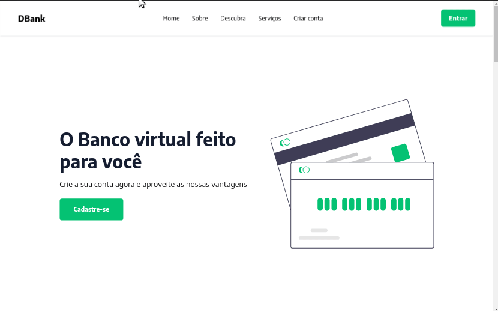
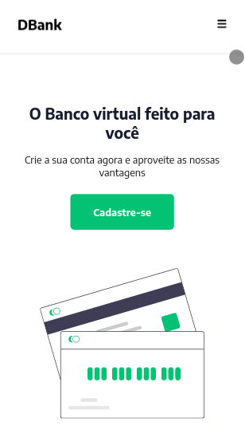

# DBank Website

Esse projeto reproduz um website criado para um banco digital fictício.

Veja o projeto - [Link para o site](https://dbank-website-react.netlify.app/)

### Tecnologias

- React Js
- Styled components
- React Icons

### Demos

#### Desktop

---

#### Mobile

