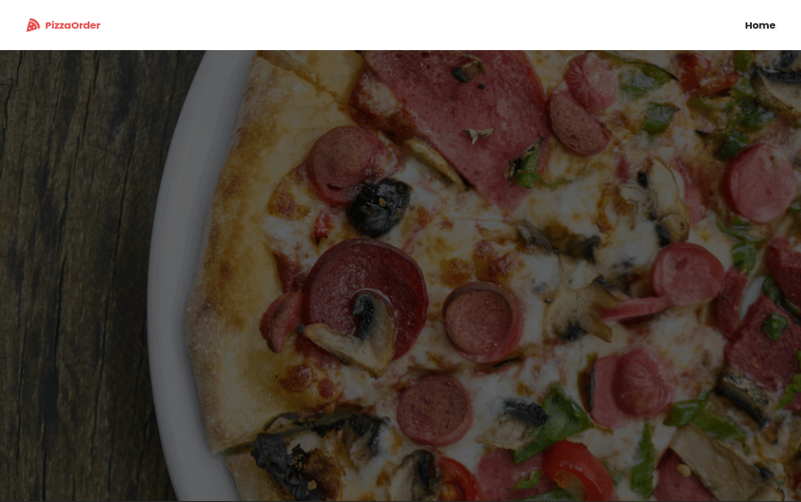

# Pizza Order React

Uma aplicação que simula um pedido de pizza, onde é possível escolher a massa e os igredientes.

Veja o projeto: [Link para o website](https://pizza-order-react.netlify.app/)

## Tecnologias

O projeto foi desenvolvido com React JS e tem o propósito de aprendizado da biblioteca Framer Motion, utilizada para animações em aplicações criadas com React.

- React JS
- Styled Components
- Framer Motion

## Demos

### Desktop

---

### Mobile

